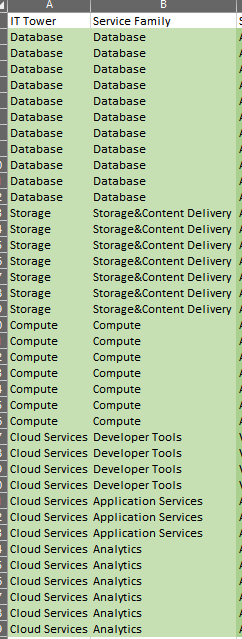
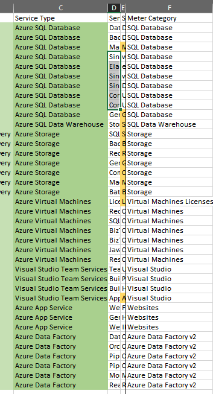
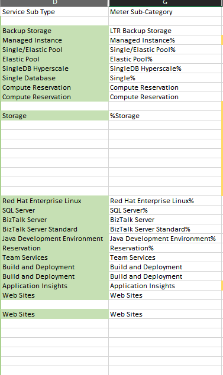
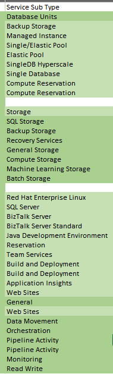
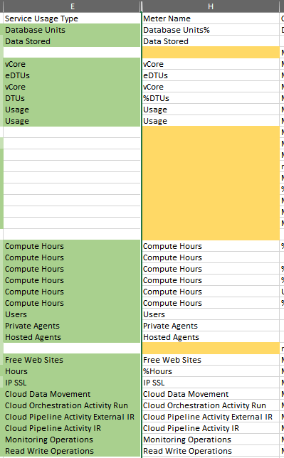
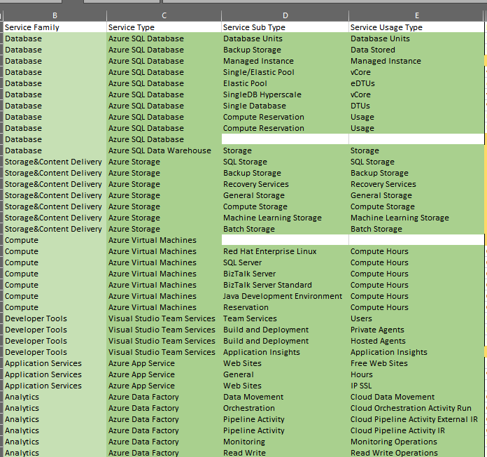

# Отчёт по лабораторной работе №2

## 1. Цель работы

Получение навыков аналитики и понимания спектра публичных облачных сервисов без привязки к вендору. Формирование у студентов комплексного видения Облака.

## 2. Алгоритм выполнения работы

1. Изучить данные из 1 лабораторной.
2. Использовать те же обозначения и тот же стиль.
3. IT Tower и Service Family просто из примеров заполняются.  
   
4. Service Type == Meter Category, но нужно посмотреть, как правильно в Azure называется.  
   
5. Затем заполнил, что смог, из Meter Sub-Category.  
   
6. Осталось незаполненные из-за пустот, проверил Meter Names и по нему нашел остатки Service Sub Type.  
   
7. Затем из Meter Name повторяются Service Usage Type.
8. 
9. То, что не повторилось, копируется из Service Sub Type, чтобы сохранить целостность.
10. Остается лишь 2 ячейки.  
    
11. Никак не узнать, заполняем general-ом.