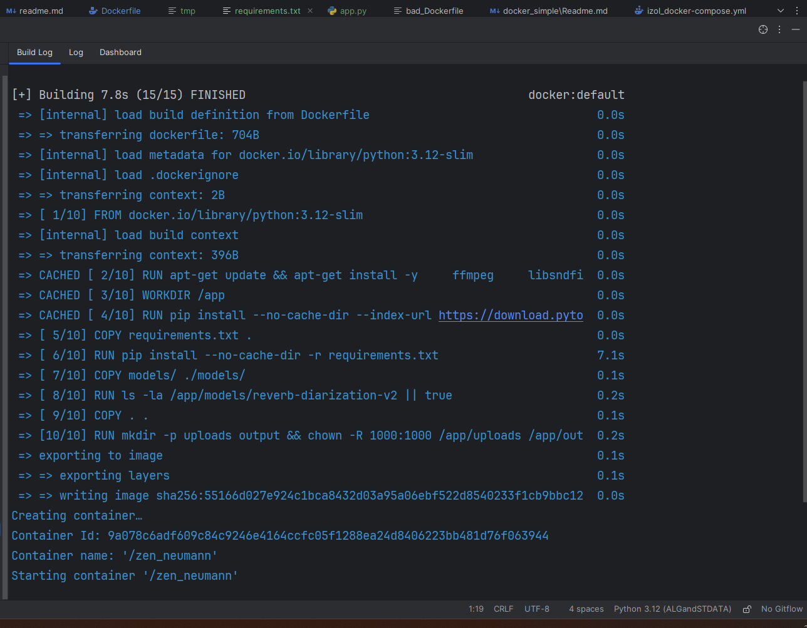
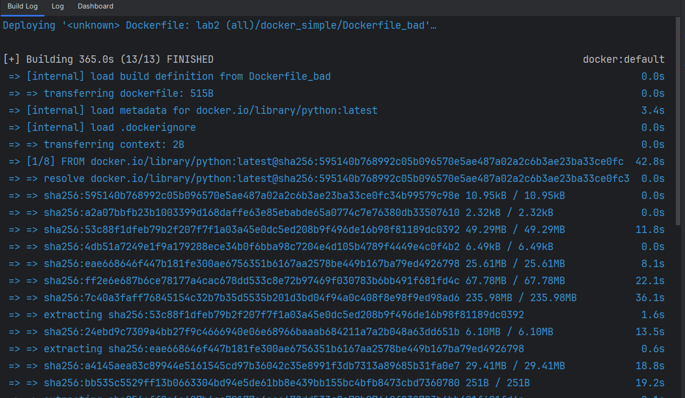
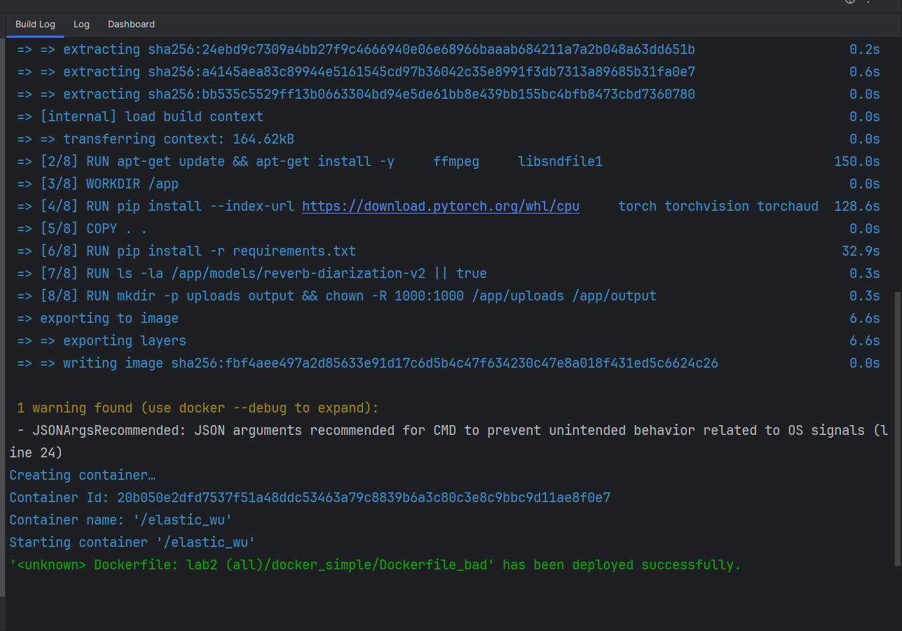

# lab-docker-simple
`Афанасьев Дмитрий Михайлович`
`Сигаева Ксения Леонидовна`

Обычная:
1) Написать “плохой” Dockerfile, в котором есть не менее трех “bad practices” по написанию докерфайлов
2) Написать “хороший” Dockerfile, в котором эти плохие практики исправлены
3) В Readme описать каждую из плохих практик в плохом докерфайле, почему она плохая и как в хорошем она была исправлена, как исправление повлияло на результат
4) В Readme описать 2 плохих практики по работе с контейнерами. ! Не по написанию докерфайлов, а о том, как даже используя хороший докерфайл можно накосячить именно в работе с контейнерами.


# Структура проекта
1) bad_Dockerfile
2) Dockerfile
3) report_1.md
4) report_2.md


# bad_practices_in_dockerfile

```dockerfile

FROM python:latest

RUN apt-get update && apt-get install -y \
    ffmpeg \
    libsndfile1

WORKDIR /app

RUN pip install --index-url https://download.pytorch.org/whl/cpu \
    torch torchvision torchaudio \
 && pip install torchmetrics

COPY . .

RUN pip install -r requirements.txt


RUN ls -la /app/models/reverb-diarization-v2 || true

RUN mkdir -p uploads output && chown -R 1000:1000 /app/uploads /app/output

EXPOSE 5000

CMD python app.py


```


1. Использование

```dockerfile
FROM python:latest
```

нестабильно, поскольку версия может меняться.

---

2. Нет очистки кеша после установки системных пакетов .
   отсутсвует 
```
rm -rf /var/lib/apt/lists/*
```

---

3. Копирование всех файлов

```dockerfile
COPY . .
```

копирует мусор и секреты. нет  `.dockerignore` 

---

4. Установка зависимостей без `--no-cache-dir`

---

5. Shell-форма команды

```dockerfile
CMD python app.py
```

надо: `CMD ["python", "app.py"]`

### исправленный вариант

```dockerfile

FROM python:3.12-slim

# системные deps для аудио/ffmpeg
RUN apt-get update && apt-get install -y \
    ffmpeg \
    libsndfile1 \
    && rm -rf /var/lib/apt/lists/*

WORKDIR /app

# Устанавливаем совместимые CPU-колёса PyTorch + torchvision + torchaudio (и torchmetrics)
# Важно: делаем это ДО pip install -r requirements.txt, чтобы pip не перезаписал/не подтянул несовместимые бинарные пакеты.
RUN pip install --no-cache-dir --index-url https://download.pytorch.org/whl/cpu \
    "torch==2.2.2+cpu" "torchvision==0.17.2+cpu" "torchaudio==2.2.2+cpu" \
 && pip install --no-cache-dir torchmetrics==1.3.1

# Копируем requirements (убедись, что в requirements.txt нет строк с torch/torchvision/torchaudio)
COPY requirements.txt .
RUN pip install --no-cache-dir -r requirements.txt

# Копирование моделей
COPY models/ ./models/

# Небольшая проверка (не фатальная — если пути другие, убери)
RUN ls -la /app/models/reverb-diarization-v2 || true

# Копирование остального проекта
COPY . .

RUN mkdir -p uploads output && chown -R 1000:1000 /app/uploads /app/output

EXPOSE 5000
CMD ["python", "app.py"]


```


---

# bad practices_with_containers

1) Хранение данных внутри контейнера
нужно использовать `Volumes`, как минимум для того, чтобы данные не сбрасывались при перезагрузке

---

2) Запуск нескольких процессов в одном контейнере. Например, у меня есть плохой в этом методологии контейнер, которы `одновременно` и `диаризирует`, и `транскриптизирует`, и `объединяет`.
по-хорошему нужно разбить на 3 контейнера с `диаризацией`, `транскриптизацией` и `объединением`


---

# Скрины запусков

## Хорошие



## Плохие



