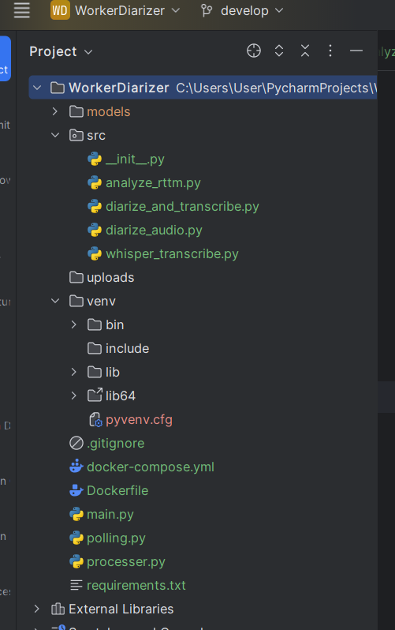

1) Хранение данных внутри контейнера
нужно использовать `Volumes`, как минимум для того, чтобы данные не сбрасывались при перезагрузке

---

2) Запуск нескольких процессов в одном контейнере. Например, у меня есть плохой в этом методологии контейнер, которы `одновременно` и `диаризирует`, и `транскриптизирует`, и `объединяет`.
по-хорошему нужно разбить на 3 контейнера с `диаризацией`, `транскриптизацией` и `объединением`

